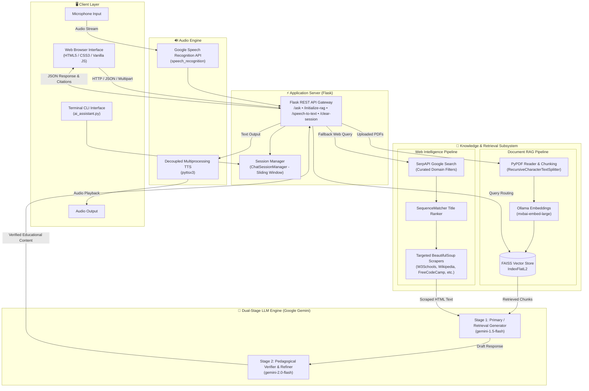
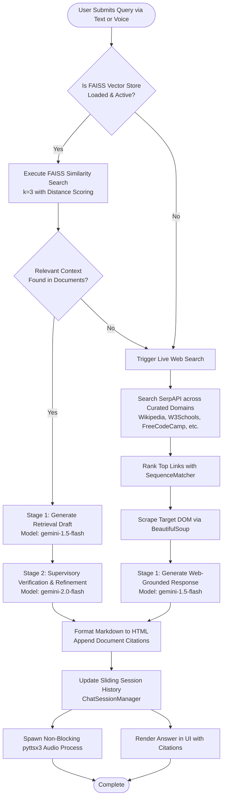

# 🎓 Multimodal Learning Assistant

<div align="center">

[](https://www.python.org/)
[](https://flask.palletsprojects.com/)
[](https://www.langchain.com/)
[](https://aistudio.google.com/)
[-purple?logo=ollama&logoColor=white)](https://ollama.ai/)
[](https://github.com/facebookresearch/faiss)
[](./LICENSE)

**An intelligent, voice-interactive educational tutor featuring dual-stage Retrieval-Augmented Generation (RAG), live web research fallback, and multi-model pedagogical verification.**

[Overview](#-overview) • [Key Features](#-key-features) • [System Architecture](#-system-architecture) • [Repository Structure](#-repository-structure) • [Tech Stack](#-technology-stack) • [Quick Start](#-quick-start) • [API Reference](#-api-reference) • [License](#-license)

</div>

---

## 🌟 Overview

The **Multimodal Learning Assistant** is a pedagogical AI platform designed to provide dynamic, accurate, and interactive learning experiences. It bridges the gap between static course materials and up-to-the-minute web research by offering:

- **Local Document Retrieval**: High-precision RAG across uploaded lecture slides, research papers, and textbooks using local Ollama embeddings and FAISS.
- **Intelligent Web Research Fallback**: Automatic targeted web scraping of authoritative educational domains when local documentation is absent.
- **Dual-Stage LLM Verification**: Multi-model reflection where a primary model drafts the educational explanation and an expert verifier model refines accuracy and pedagogical structure before delivery.
- **Multimodal Voice Interface**: Full hands-free interaction with ambient-adjusted speech recognition and non-blocking text-to-speech audio narration.
- **Dual User Experiences**: Available both as a sleek, modern web application and as an interactive terminal CLI.

---

## 🚀 Key Features

### 📄 Dynamic RAG Pipeline
- **Flexible Document Ingestion**: Upload single PDFs, batch files, or entire directories.
- **Hierarchical Text Chunking**: `RecursiveCharacterTextSplitter` with 1,000-character chunks and 200-character overlaps for contextual continuity.
- **Local Dense Embeddings**: Embeddings generated locally via Ollama's `mxbai-embed-large` model, ensuring fast processing and zero embedding API costs.
- **FAISS Vector Index**: Fast vector similarity search with Euclidean distance (`IndexFlatL2`) and source page tracking.

### 🌐 Curated Live Web Intelligence
- **Targeted Query Routing**: When no local document matches, queries route through SerpAPI Google Search filtered across authoritative technical sites:
  - `en.wikipedia.org`
  - `w3schools.com`
  - `tutorialspoint.com`
  - `freecodecamp.org`
  - `programiz.com`
  - `tpointtech.com` (JavatPoint)
- **Title Similarity Ranking**: Python's `SequenceMatcher` ranks the top search results to pick the highest relevance page.
- **Custom DOM Scrapers**: Tailored BeautifulSoup parsers extract pure educational text without navigational noise or advertisements.

### 🛡️ Dual-Stage LLM Verification Pipeline
- **Draft Generation**: `gemini-1.5-flash` analyzes the query and retrieved context to construct a structured lesson.
- **Supervisor Verification**: `gemini-2.0-flash` performs a confidential verification pass, eliminating hallucinations, formatting key concepts, and ensuring pedagogical clarity.
- **Sliding-Window Chat Memory**: `ChatSessionManager` maintains rolling history (last 20 messages) per session for coherent multi-turn conversations.

### 🎙️ Multimodal Audio Interface
- **Ambient-Aware Speech-to-Text**: Converts microphone voice queries to text using `SpeechRecognition` and the Google Speech API with automatic background noise adjustment.
- **Interruptible Text-to-Speech**: Built with `pyttsx3` running in a decoupled `multiprocessing` worker. Speech can be interrupted or stopped at any time without freezing the server.

### 💻 Modern Web & CLI Interfaces
- **Responsive Web Dashboard**: Animated audio waveforms, live RAG status dots, auto-resizing text inputs, and collapsible source citation drawers (`<details>`).
- **Interactive Terminal Assistant**: Full-featured CLI utility (`ai_assistant.py`) for headless servers or terminal lovers.

---

## 🏗️ System Architecture

### High-Level Architecture Diagram



---

### Query Decision & Verification Flowchart

The following flowchart illustrates how the assistant routes incoming questions between RAG and Web Scraping, followed by dual-stage verification:



---

## 📁 Repository Structure

```plaintext
Multimodal_Learning_Assistant/
├── aiFeatures/
│   ├── .env.example                     # Environment variables template for AI modules
│   └── python/
│       ├── ai_assistant.py              # Interactive CLI runner for terminal-based interaction
│       ├── ai_response.py               # Prompt templates, session manager, and Gemini dual-stage LLM chains
│       ├── rag_pipeline.py              # PDF text extraction, chunking, Ollama embeddings, and FAISS store
│       ├── speech_to_text.py            # Microphone speech recognition with Google Speech API
│       ├── text_to_speech.py            # Multiprocessing-based pyttsx3 voice synthesis
│       ├── web_scraper_tool.py          # Domain-specific BeautifulSoup parsers & LangChain Tool wrapper
│       └── web_scraping.py              # SerpAPI Google search, similarity ranking, and file caching
├── testFrontend/
│   └── FlaskApp/
│       ├── app.py                       # Core Flask backend server and REST endpoint routing
│       ├── templates/
│       │   └── index.html               # Responsive chat interface with audio waves & RAG status
│       └── static/
│           ├── script.js                # Frontend client logic, REST calls, voice controls, and UI animations
│           └── style.css                # Polished modern theme, animations, and responsive layout
├── .env.example                         # Root environment variable template
├── LICENSE                              # MIT License definition
├── requirements.txt                     # Complete project Python dependencies
└── README.md                            # Comprehensive technical documentation
```

---

## 🛠️ Technology Stack

| Layer | Component | Description |
| :--- | :--- | :--- |
| **Language & Runtime** | Python 3.12+ | Core programming runtime |
| **Backend Framework** | Flask & Flask-CORS | REST API server, file handling, and cross-origin resource sharing |
| **LLM Orchestration** | LangChain Core & Google GenAI | Prompt pipelining, chains (`LCEL`), and chat session management |
| **Primary LLMs** | Google Gemini 1.5 Flash | Fast drafting of document and web-grounded content |
| **Verification LLM** | Google Gemini 2.0 Flash | High-accuracy supervisor for factual verification and pedagogical polish |
| **Vector Embeddings** | Ollama (`mxbai-embed-large`) | High-dimensional local dense text embeddings |
| **Vector Database** | FAISS (`faiss-cpu`) | High-performance similarity search and nearest neighbor indexing |
| **PDF Extraction** | PyPDF (`pypdf`) | Page-by-page document parsing and metadata extraction |
| **Web Research** | SerpAPI & BeautifulSoup4 | Live Google organic results search and DOM article scraping |
| **Speech Recognition** | SpeechRecognition | Audio capture from microphone with Google Speech Recognition API |
| **Voice Synthesis** | pyttsx3 & Multiprocessing | Native text-to-speech audio engine running in interruptible child processes |
| **Frontend UI** | HTML5, CSS3, JavaScript | Modern, glass-inspired user interface with live waveforms and markdown styling |

---

## ⚡ Quick Start

### 1. Prerequisites

Ensure you have the following installed on your system:
- **Python 3.12+**
- **Ollama**: [Download & install Ollama](https://ollama.ai/)
- **Microphone & Speaker**: Configured as default system audio devices

### 2. Clone the Repository

```bash
git clone https://github.com/HarshaaMg/Multimodal_Learning_Assistant.git
cd Multimodal_Learning_Assistant
```

### 3. Create and Activate Virtual Environment

**Windows (PowerShell / Command Prompt):**
```powershell
python -m venv env
.\env\Scripts\activate
```

**macOS / Linux:**
```bash
python3 -m venv env
source env/bin/activate
```

### 4. Install Dependencies

```bash
pip install -r requirements.txt
```

> [!NOTE]
> On Linux, install system audio libraries if required: `sudo apt-get install portaudio19-dev libasound2-dev espeak`.

### 5. Pull Ollama Embedding Model

Make sure the Ollama daemon is running, then pull the embedding model:

```bash
ollama pull mxbai-embed-large
```

### 6. Configure Environment Variables

Copy the environment template:

**Windows:**
```powershell
copy .env.example .env
```

**macOS / Linux:**
```bash
cp .env.example .env
```

Edit `.env` and provide your credentials:

```env
# Google Gemini API Key (https://aistudio.google.com/)
GOOGLE_API_KEY="your_google_gemini_api_key_here"

# SerpApi Key for live educational search (https://serpapi.com/)
SERP_API_KEY="your_serpapi_key_here"

# Ollama Embedding Model (Default: mxbai-embed-large)
OLLAMA_MODEL="mxbai-embed-large"
```

---

## 🖥️ Running the Application

### Option A: Web Application (Recommended)

1. Navigate to the Flask application directory and start the server:

```bash
cd testFrontend/FlaskApp
python app.py
```

2. Open your web browser and navigate to:
```
http://localhost:5500
```

3. **How to Use the Web Interface**:
   - 📎 **Upload PDFs**: Click the paperclip button to upload one or more PDF documents. The indicator dot will change from gray to green (**PDFs loaded - RAG enabled**).
   - 💬 **Ask Questions**: Type your prompt into the input bar and press `Enter` or click the paper-plane button.
   - 🎙️ **Voice Mode**: Click the microphone icon to speak. An animated sound wave displays while the system listens.
   - 🛑 **Stop Audio**: Press the stop button to instantly halt voice playback.
   - 📚 **Inspect Sources**: Expand the "View retrieved information" or "View scraped information" dropdowns to inspect citations.

---

### Option B: Terminal CLI Assistant

For headless servers or terminal-based tutoring:

```bash
python aiFeatures/python/ai_assistant.py
```

1. Select document loading mode:
   - `0`: No documents (Web Search only)
   - `1`: Single PDF file path
   - `2`: Comma-separated list of PDF file paths
   - `3`: Folder containing PDFs
2. Choose your input mode (`1` for Text, `2` for Voice).
3. Interact directly through the terminal with audio output playback!

---

## 🔌 API Reference

The Flask server provides the following REST endpoints:

| Endpoint | Method | Content-Type | Description |
| :--- | :--- | :--- | :--- |
| `/` | `GET` | `text/html` | Serves the main web chat application interface. |
| `/initialize-rag` | `POST` | `multipart/form-data` | Ingests PDF files (`files`) or folder path (`folder`) and builds the FAISS index. |
| `/ask` | `POST` | `application/json` | Processes a text query through RAG or Web Scraping and returns verified answer. |
| `/clear-session` | `POST` | `application/json` | Clears conversation memory and resets the vector store index. |
| `/speech-to-text` | `POST` | `application/json` | Listens to the microphone and returns recognized text. |
| `/text-to-speech` | `POST` | `application/json` | Synthesizes speech from provided text in a background process. |
| `/stop-speech` | `POST` | `application/json` | Terminates the active text-to-speech multiprocessing worker. |

### Sample Request & Response: `/ask`

**Request:**
```json
POST /ask
Content-Type: application/json

{
  "query": "Explain how backpropagation works in neural networks."
}
```

**Response (Document Retrieval Mode):**
```json
{
  "response": "<p><strong>Backpropagation</strong> is the fundamental algorithm used to train neural networks...</p>",
  "retrieved": "Result 1 (Similarity: 0.8842):\nFile: deep_learning.pdf, Page: 14/85\nContent: Backpropagation computes the gradient...",
  "hasRetrieval": true
}
```

**Response (Web Intelligence Fallback Mode):**
```json
{
  "response": "<p>Based on live technical documentation, backpropagation calculates the gradient of the loss function...</p>",
  "scraped": "Backpropagation is a widely used algorithm in machine learning...",
  "hasScraping": true
}
```

---

## 🔍 In-Depth Engineering Highlights

### 1. Dual-Stage LLM Verification Pipeline
Standard single-prompt RAG setups often pass raw retrieved context directly to one model, leading to formatting inconsistencies or subtle hallucinations. The Multimodal Learning Assistant implements a **Two-Model Review Workflow**:
- **Stage 1 (Generation)**: An educational generator prompt extracts relevant points from the vector database or scraped content.
- **Stage 2 (Verification)**: A specialized pedagogical prompt instructs `gemini-2.0-flash` to act as an invisible supervisor. It checks factual alignment with reference text, resolves ambiguity, enriches the explanation with intuitive analogies, and formats key concepts using structured Markdown.

### 2. Multi-Domain Resilient Scraping
Instead of open-ended search scraping which frequently encounters bot blocks and low-quality results:
- Searches are restricted to curated educational domains (`ALLOWED_SITES`) using the Google `site:` operator.
- The top organic candidates are evaluated against the query using `difflib.SequenceMatcher` to select the highest-scoring article title.
- Specialized parsers extract the core reading container (e.g., `#main`, `#mainContent`, `<article>`), discarding banners, navbars, and ads.

### 3. Non-Blocking Audio Multiprocessing
In Python, running text-to-speech (`pyttsx3`) directly inside the Flask request thread blocks the server until the audio finishes speaking. This project wraps `pyttsx3` execution inside a `multiprocessing.Process`:
- The audio engine runs asynchronously in a detached child process.
- Calling `/stop-speech` triggers `process.terminate()` followed by `process.join()`, allowing users to interrupt long responses immediately.

---

## 🧪 Troubleshooting

<details>
<summary><strong>1. Ollama Connection or Embedding Errors</strong></summary>

- **Error**: `ConnectionRefusedError` or `OllamaEmbeddings` fails to initialize.
- **Solution**: Ensure the Ollama service is active. Run `ollama list` in your terminal and verify `mxbai-embed-large` is listed. If missing, run:
  ```bash
  ollama pull mxbai-embed-large
  ```
</details>

<details>
<summary><strong>2. PyAudio Installation on Windows / Linux</strong></summary>

- **Windows**: If `pip install pyaudio` fails, install the precompiled wheel:
  ```powershell
  pip install pipwin
  pipwin install pyaudio
  ```
- **Linux (Ubuntu/Debian)**:
  ```bash
  sudo apt-get update && sudo apt-get install portaudio19-dev python3-pyaudio
  ```
</details>

<details>
<summary><strong>3. Web Scraping Returns No Content</strong></summary>

- **Check SerpAPI Key**: Ensure `SERP_API_KEY` in `.env` is valid and has remaining search quota.
- **Network / Firewalls**: Ensure outgoing HTTPS requests to `serpapi.com` and educational sites are permitted.
</details>

<details>
<summary><strong>4. Audio Speech Not Audible</strong></summary>

- Check that system volume is turned up and default speakers are active.
- On Windows, `pyttsx3` uses Microsoft SAPI5. Ensure at least one SAPI5 voice is installed in Windows Speech settings.
</details>

---

## 🤝 Contributing

Contributions are warmly welcomed! To contribute:

1. **Fork** the repository.
2. **Create a Feature Branch**:
   ```bash
   git checkout -b feature/amazing-feature
   ```
3. **Commit Your Changes**:
   ```bash
   git commit -m "feat: add amazing new feature"
   ```
4. **Push to the Branch**:
   ```bash
   git push origin feature/amazing-feature
   ```
5. **Open a Pull Request** with a detailed summary of your changes.

---

## 📄 License

This project is open-source and licensed under the terms of the [MIT License](./LICENSE).

---

<div align="center">
Built with ❤️ by <a href="https://github.com/HarshaaMg">Harshaa M G</a>
</div>
